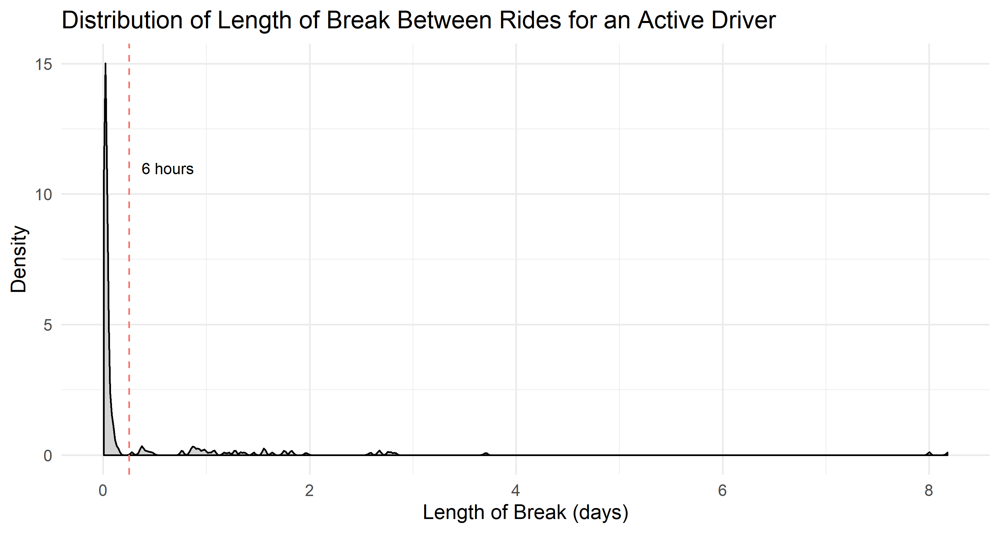

Due to the fact that the provided data spanned only three months, calculating a driver's lifetime value proved to be a challenge. Some drivers clearly had a lifetime longer than three months for which we do not have data for. If we do not know when a driver stopped driving, it would be very difficult to calculate anything relating to a "lifetime". What we can do, however, is first try to determine which drivers quit within 90 days and which drivers were still active.

We first noted the last timestamp given among all drivers: `2016-06-27 00:50:50 UTC`. [UPDATE TIMESTAMP]Then we found the difference between this last timestamp and the last ride timestamp for each driver - this is essentially the last break that each driver took. If the last break is some duration such as 50 days, it is easy to conclude that the driver quit, as he or she has no recorded rides in the last 50 days of the []. What if the last break was 4 days, or 4 hours?

To answer this question for every driver, we must know more about their driving habits. Do they consistently drive every day or do they tend to take longer breaks? After calculating the difference in time for every ride a driver made, it is clear that there are two types of breaks. +@fig:1 is a density plot to show the distribution of breaks for a very active driver: 

{#fig:1 width=7in}

This data suggests that drivers often work in "sessions" - periods of hours at a time when they are continuously looking for rides, which makes a lot of sense. The large spike on the left corresponds to all the breaks a driver makes when searching for a new ride, which is usually on the order of minutes. The smaller hills to the right represent the breaks between sessions. If a driver actually quit, then their last break should be a break between sessions. Furthermore, the last break should be significantly greater than the other session breaks a driver has taken. 

After looking at the break distributions for all the drivers, we determined the cutoff between the types of breaks to be 5-6 hours. This is corroborated by Lyft's time limit policy, which prevents drivers from driving for longer than 14 hours at a time without taking an uninterrupted 6 hour break. 

Now that we know exactly which breaks can be considered breaks between sessions, it's easy to determine whether the last break was significant or not. After filtering out all the drivers whose last break was significant, we determined that out of 837 drivers that gave rides, 259 of them quit within the 90 day period.

## Recommend a Driver's Lifetime Value (i.e., the value of a driver to Lyft over the entire projected lifetime of a driver).

- the wording of this question implies that we don't know what the lifetime of a driver is
- we know the exact value a driver brought to lyft if they quit in 3 months
-
- we can split between quitters and non-quitters and find a formula?
- Drivers who we deemed quit within three months made $1807.02 on average.

### What are the main factors that affect a driver's lifetime value?
- ideas
  - total revenue brought in
  - total number of rides

- It's clear that the more rides a driver does, the more total value they bring

- Does Lyft care about a driver's driving pattern?
- If Lyft had total control, how many Lyft drivers would they employ and at what time?
- The surge pricing is a way to combat having more riders than drivers. It filters the riders to those willing to pay the highest price.
-

### What is the average projected lifetime of a driver? That is, once a driver is onboarded, how long do they typically continue driving with Lyft?
- Not able to answer this question in full yet
- What we do know:
  - Out of 837 drivers that we have complete ride data for, 259 (30.9%) quit within 90 days
  - Among the drivers that quit within 3 months, the average career lifetime was 34 days

### Do all drivers act alike? Are there specific segments of drivers that generate more value for Lyft than the average driver?
- What does "more value for Lyft than the average driver mean?"
  - does this mean more total value or value per unit time or ride
- We should analyze this problem disregarding the total amount a driver has made. Instead, we want to take a look at amount made per ride or amount made per time

Statistics for the Average Driver:

- Number of rides: 220
- Mean earnings per ride: $13.64
- Mean ride distance: 4.47 miles
- Mean ride duration: 14.33 minutes
- Mean scaled eagerness: 0.67
- Mean scaled response time: 0.67
- Mean prime time weighted by durations: 16.57

### What actionable recommendations are there for the business?
- take more money from driver's with higher insurance costs

Ymd HMS

- Started off with:
  - 937 drivers
  - 193,502 rides

- Analyzing
  - 837 drivers
  - 184,209 rides
