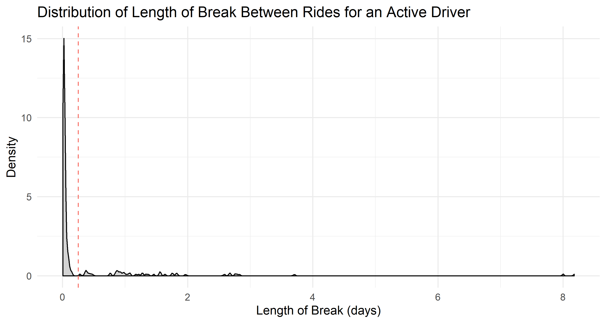
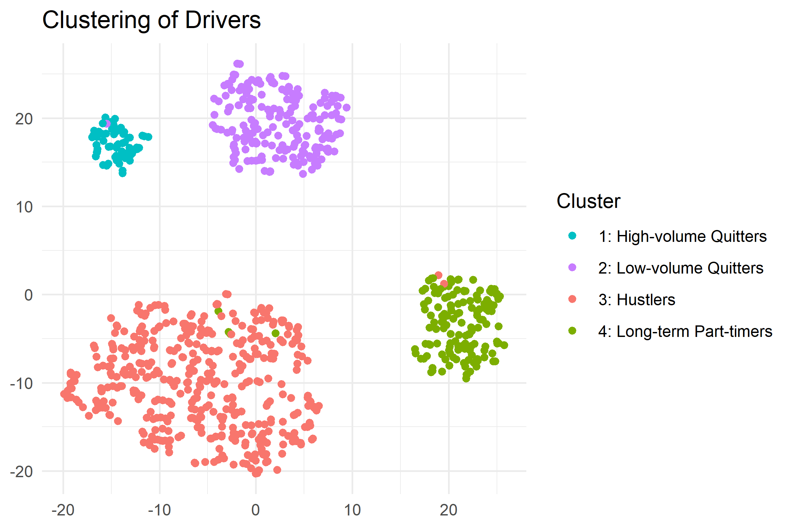

# Statement of Problem

# Driver Attributes

Due to the fact that the provided data spanned only three months, calculating a driver's lifetime value proved to be a challenge. Some drivers clearly worked longer than three months for which we do not have data for, making it be very difficult to calculate anything relating to a "lifetime". What we can do, however, is first try to determine which drivers quit within 90 days and which drivers were still active.

We first noted the last timestamp given among all drivers: `2016-06-27 00:50:50 UTC`. [UPDATE TIMESTAMP]Then we found the difference between this last timestamp and the last ride timestamp for each driver - this is essentially the last break that each driver took. If the last break is some duration such as 50 days, it is easy to conclude that the driver quit, as he or she has no recorded rides in the last 50 days of the []. What if the last break was 4 days, or 4 hours?

To answer this question for every driver, we must know more about their driving habits. Do they consistently drive every day or do they tend to take longer breaks? After calculating the difference in time for every ride a driver made, it is clear that there are two types of breaks. Fig.1 is a density plot displaying the distribution of breaks for a very active driver: 

{#fig:1 width=7in}

[figure legend - driver id = "002be0ffdc997bd5c50703158b7c2491"]

This data suggests that drivers often work in "sessions" - periods of hours at a time when they are continuously looking for rides, which makes a lot of sense. The large spike on the left corresponds to all the breaks a driver makes when searching for a new ride, which is usually on the order of minutes. The smaller hills to the right represent the breaks between sessions. If a driver actually quit, then their last break should be a break between sessions. Furthermore, the last break should be significantly greater than the other session breaks a driver has taken. 

After looking at the break distributions for all the drivers, we determined the cutoff between the types of breaks to be 5-6 hours. This is corroborated by Lyft's time limit policy, which prevents drivers from driving for longer than 14 hours at a time without taking an uninterrupted 6 hour break. 

We can now categorize each break longer than 6 hours as a "break between session." We considered the last break a driver took to be significant if it was 

1. greater than two standard deviations above the mean length of session breaks, and
2. at least 98% of the previous longest break between sessions a driver took

The reason for #2 is that if a driver has previous history of taking an x day break that is considered significant, we can assume that they may take a break of similar length again. After filtering out all the drivers whose last break was significant, we determined that out of 837 drivers that gave rides, 259 (30.9%) of them quit within the 90 day period. The average career length of these quitters was 34 days.

We continued to extract attributes from the data such as quitting or not quitting. An explanation follows the attributes that are not intuitive based on name.

- **Career length (days):** how long it has been since a driver onboarded. This is mostly relevant for drivers that quit
- **Average Ride Duration (minutes)**
- **Average Ride Distance (miles)**
- **Number of Rides Given**
- **Eagerness (scaled 0 to 1):** a measure of how "eager" a driver is to take a ride, equivalent to the inverse of the *time* *difference between when a ride is requested and when the driver accepts a ride*. The driver with an eagerness of 1 is the quickest among all drivers to accept a ride
- **Response Time (scaled 0 to 1):** a measure of how far drivers are willing to travel for a ride, equivalent to the inverse of the *time difference between when a driver accepts a ride and when they arrive at the pickup location*. The driver with a response time of 1 is quickest to arrive at the pickup location.
- **Average Prime Time (weighted by ride duration, 0 to 100)**

Of these attributes, the distribution of **Number of Rides Given** was very interesting as it was was bimodal.

 

We noted that this distinction between giving many or few rides could be a result of treating Lyft driving as either a full-time or part-time job. We hypothesized that that drivers could be classified by either quitting or non-quitting and by high-volume of rides or low-volume of rides given. Additionally, we believe these two factors are independent.

At this point, it became clear that our population of drivers could be separated into distinct groups, in addition to being a quitter or not. We defined the following attributes for each driver in an attempt to group them by PCA (Principle Component Analysis) clustering.

# Clusters

It is important to note our clustering methodology was unsupervised, meaning we did not influence the model by indicating which attributes were more important or how to segregate drivers. Thus, the PCA analysis helps to confirm that these four types of drivers do exist. The following figure and table define our clusters and provide descriptive statistics for each cluster. 

| Cluster Name          | Average Earnings per Ride (USD) | Average Ride Distance (miles) | Average Ride Duration (mins) | Average Eagerness | Average Responsiveness | Average Number of Rides Given | Average Prime Time Weighted by Ride Duration | Size | Number of Days Worked | Average Number of Rides Per Day Worked |
| --------------------- | ------------------------------- | ----------------------------- | ---------------------------- | ----------------- | ---------------------- | ----------------------------- | -------------------------------------------- | ---- | --------------------- | -------------------------------------- |
| High-volume Quitters  | 13.6                            | 4.22                          | 14.49                        | 0.69              | 0.66                   | 335.43                        | 19.42                                        | 61   | 40.95                 | 9                                      |
| Low-volume Quitters   | 13.56                           | 4.57                          | 14.04                        | 0.67              | 0.67                   | 43.07                         | 14.97                                        | 198  | 10.75                 | 5                                      |
| Hustlers              | 13.49                           | 4.28                          | 14.3                         | 0.68              | 0.69                   | 341.57                        | 17.71                                        | 436  | 45.29                 | 8                                      |
| Long-term Part-timers | 14.23                           | 5.09                          | 14.73                        | 0.63              | 0.65                   | 44.33                         | 14.07                                        | 142  | 13.18                 | 4                                      |

Note: the cluster naming was done after all analysis was completed and the quitting attribute was merged into the cluster name - all clusters were homogenous in quitters or non-quitters.

We have shown that not all drivers act alike, but how should we determine which driver's are generating more value for Lyft? The Hustlers clearly make the most total revenue for Lyft, but that is simply due to the volume of rides they give, making this point rather uninteresting. So, let's consider earnings when number of rides is controlled for. In this case, Long-term Part-timers stand out. They make $0.59 more than the average driver per ride. One explanation for this is their speed. By using average ride duration and distance, we found that that long-term part timers drove at an average speed of 20.73 mph, compared to 18.72 mph of the average driver. Essentially, these drivers are making more money per ride by choosing slightly longer rides and driving a little faster. 

Another group to note is the High-Volume quitters, who have average the highest weighted Prime Time per ride.  We believe this group is also very important. Although these drivers make average earnings per ride, their willingness to drive more during Prime Time is beneficial towards Lyft as a company. In general, if rides in an area are subject to Prime Time pricing, then there are a lot of riders compared to drivers in Lyft and other competitors such as Uber. This is a common situations where a rider may switch from Uber to Lyft and vice versa. Having more drivers available during busy hours is crucial in controlling more of the market. 

That leaves just the Low-volume quitters. Looking at the two clusters of quitters by themselves yields more surprising results. Here, the number of rides given by the quitters is plotted against career length

The high-volume quitters give a varying amount of rides before quitting. Since the high-volume drivers seem to be driving full time, we suspect that these are drivers are looking for more traditional jobs and chose to drive for Lyft in the meantime. They then quit when they found another job. It wouldn't make sense for a full-time Lyft driver to quit otherwise. The low-volume group, however, consistently quits after around 40 rides, regardless of career length. They drive less often and complete only half as many rides as their high-volume quitter counterparts. This trend suggests another factor is causing these low-volume drivers to quit. 

# Lifetime Values 

The lifetime value of a driver that quit within 3 months is calculable since the data for the entire lifetime is available - it's the sum of each ride's earnings. We are going to assume that Lyft's revenue is proportional to the amount of money that a driver makes based on the ride fare formula. This was calculated to be $1523.09. 

For non-quitters, lifetime value is a function of career length. On average, drivers that stick with Lyft long term generate $40.36 per day. Therefore, lifetime value would be 40.36 x career length in days. The 90 day value of non-quitters is $3632.63.

# Business Recommendations 

One of the best ways to increase a driver's value towards Lyft is stopping a driver from quitting. We recommend adding some type of '50 rides achievement' in order to incentivize low-volume quitters to keep driving. Since quitting after around 40 rides is extremely common, we believe this is a great way to specifically target a group that has the potential to generate a lot more value. 